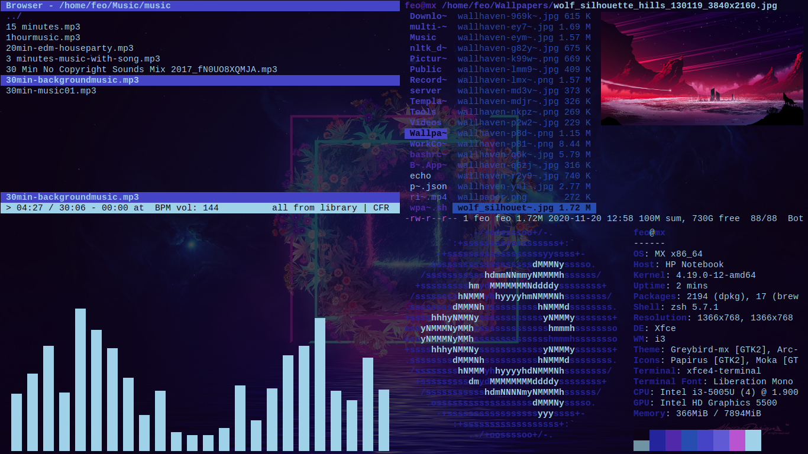

# Linux Rice Config Files

## Config paths

> i3 config path: ~/.config/i3/config

> i3status config path: ~/.config/i3status/config

> init.vim (neovim) config path: ~/.config/nvim/init.vim

> zshrc config path: ~/.zshrc

> wallpaper script path: ~/.wpaper.sh 

> wallpaper folder path: ~/Wallpapers

> qutebrowser config path: ~/.config/qutebrowser/config.py

> xfce4 terminal config path: ~/.config/xfce4/terminal/terminalrc

> ranger config path: ~/.config/ranger/rc.conf

> rifle config path: ~/.config/ranger/rifle.conf

## Applications

- Operating System: [MX Linux](https://mxlinux.org/)
- Desktop Environment: [XFCE](https://www.xfce.org/)
- Window Manager: [i3](https://i3wm.org/)
- Status Bar: [i3status](https://i3wm.org/i3status/)
- Launcher: [rofi](https://github.com/davatorium/rofi)
- Notification: [dunst](https://dunst-project.org/)
- File Manager: [ranger](https://github.com/ranger/ranger)
- Image Preview: [ueberzug](https://github.com/seebye/ueberzug)
- Browser: [qutebrowser](https://qutebrowser.org/)
- Text Editor: [neovim](https://neovim.io/)
- Terminal: [xfce4-terminal](https://docs.xfce.org/apps/terminal/start)
- Shell: [zsh](https://ohmyz.sh/)
- Word Processor: [FeatherPad](https://github.com/tsujan/FeatherPad)
- Document Viewer: [mupdf](https://mupdf.com/)
- Video Player: [mpv](https://mpv.io/)
- Music Player: [cmus](https://cmus.github.io/)
- Podcast: [Clementine](https://www.clementine-player.org/)
- Music Visualizer: [cava](https://github.com/karlstav/cava)
- Audio Controller: [Pavucontrol](https://freedesktop.org/software/pulseaudio/pavucontrol/)
- Image Viewer: [feh](https://linux.die.net/man/1/feh)
- Password Manager: [Buttercup](https://buttercup.pw/)
- Screen Recorder: [Kazam](https://launchpad.net/kazam)
- Screenshot: [Flameshot](https://github.com/flameshot-org/flameshot)
- Sysmte Info: [neofetch](https://github.com/dylanaraps/neofetch)
- Process Viewer: [htop](https://htop.dev/)
- Version Control: [git](https://git-scm.com/)
- Color Scheme: [pywal](https://github.com/dylanaraps/pywal)

